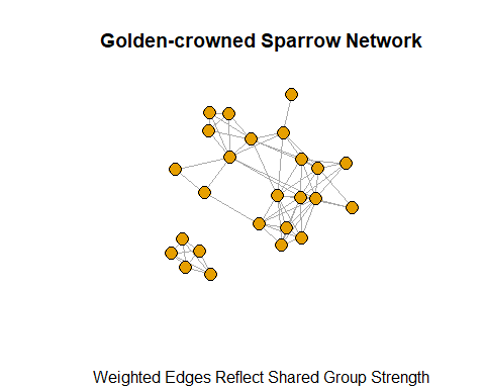
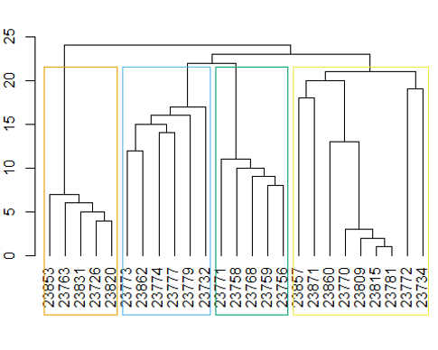
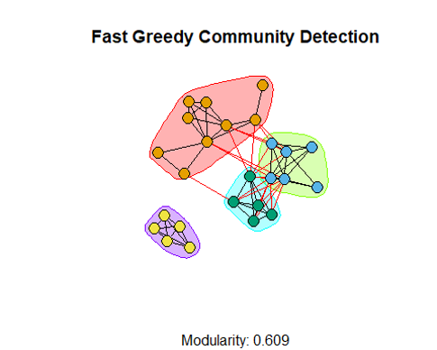
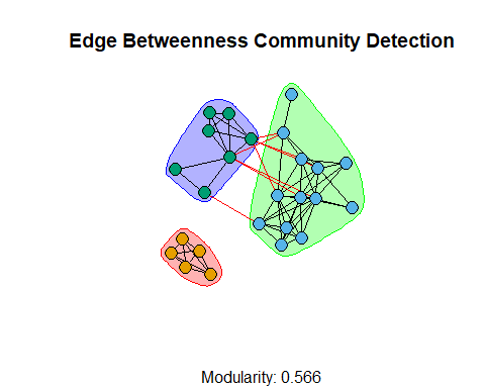
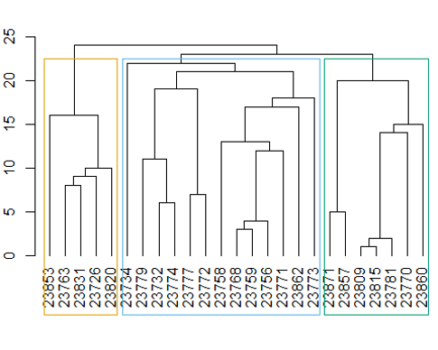
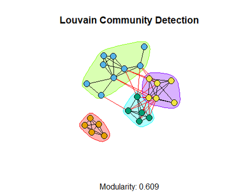
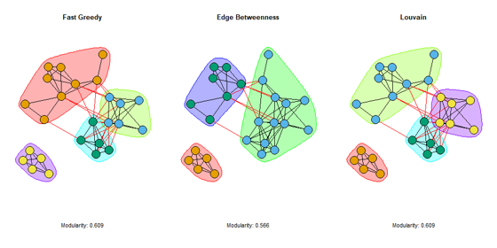

# Community Detection Methods

**Published results:** [Read the rendered report on Posit Connect Cloud](https://01a0bbd5-5c89-a860-3c73-6fdd567d84b2.share.connect.posit.cloud/)  
**Public source:** [`community-detection-methods.Rmd`](community-detection-methods.Rmd)

This analysis uses an association network of golden-crowned sparrows to compare three community-detection methods in R/`igraph`: Fast Greedy, Edge Betweenness (Girvan–Newman), and Louvain. The report turns repeated co-occurrence observations into a weighted network, then asks how consistently the algorithms identify groups of strongly associated birds.

## Contents

- [Purpose and research questions](#purpose-and-research-questions)
- [Setup and packages](#setup-and-packages)
- [Data acquisition and attribution](#data-acquisition-and-attribution)
- [Import and preparation](#import-and-preparation)
- [Association calculation: Simple Ratio Index](#association-calculation-simple-ratio-index)
- [Graph construction](#graph-construction)
- [Analysis workflow](#analysis-workflow)
- [Fast Greedy](#fast-greedy)
- [Edge Betweenness (Girvan–Newman)](#edge-betweenness-girvannewman)
- [Louvain (multilevel)](#louvain-multilevel)
- [Algorithm comparison](#algorithm-comparison)
- [Results and interpretation](#results-and-interpretation)
- [Conclusion and limitations](#conclusion-and-limitations)
- [Reproducibility](#reproducibility)
- [Repository contents](#repository-contents)

## Purpose and research questions

Community detection identifies groups of nodes that are more densely connected to one another than to the rest of a network. Here, the nodes represent individual golden-crowned sparrows and the links represent observed associations between them.

The analysis asks:

1. What community structure appears in the weighted sparrow association network?
2. Do different algorithms identify the same groups?
3. How do the algorithms differ in modularity, community count, and interpretation?
4. Which partition provides the most useful summary of this particular network?

These are exploratory network questions. They do not establish biological causation, explain why an association occurs, or generalize beyond the supplied sample network.

## Setup and packages

Install R and the packages used by the source:

```r
install.packages(c("asnipe", "igraph", "rmarkdown"))
```

The main roles are:

- `asnipe` — converts group-by-individual observations into association networks and calculates association indices;
- `igraph` — constructs the weighted graph, runs community algorithms, calculates modularity, and draws the network;
- `rmarkdown` — renders the reproducible report.

The source sets a random seed (`246`) for network layouts where a plotted layout is generated. Exact appearance can still vary with package versions and graphics devices.

## Data acquisition and attribution

The analysis reads the public sample association file directly from the source maintained by Shizuka and collaborators:

<https://dshizuka.github.io/networkanalysis/SampleData/Sample_association.csv>

The repository does **not** upload or redistribute the raw CSV. Rendering requires internet access and depends on that public URL remaining available. The data and scientific context should be attributed to the original source and publication; this repository documents the analysis workflow rather than claiming ownership of the observations.

## Import and preparation

The R Markdown source imports the matrix with row names preserved:

```r
assoc <- as.matrix(read.csv(
  "https://dshizuka.github.io/networkanalysis/SampleData/Sample_association.csv",
  header = TRUE,
  row.names = 1
))
```

The imported table represents group observations across individuals. The source transposes the matrix for the `asnipe` workflow:

```r
gbi <- t(assoc)
```

No local absolute paths, private files, or committed raw data are required. The input remains an external public dependency.

## Association calculation: Simple Ratio Index

The analysis converts co-occurrence observations into pairwise association strengths with the **Simple Ratio Index (SRI)**:

```r
mat <- get_network(t(assoc), association_index = "SRI")
```

SRI expresses how often two individuals are observed together relative to the observation opportunities in which either could have been observed. The resulting values become weighted edges: a larger edge weight indicates stronger observed association in this sample. SRI is an index of association, not a direct measure of friendship, causation, or biological fitness.

## Graph construction

The SRI matrix is converted to an undirected, weighted `igraph` object:

```r
g.sparrow <- graph_from_adjacency_matrix(
  mat,
  mode = "undirected",
  weighted = TRUE
)
```

The first figure shows the input network before community colors are added. Vertices are sparrows, and edge width reflects the SRI weight.



*Figure 1. Weighted association network. Thicker edges represent stronger shared-group association in the SRI matrix.*

## Analysis workflow

The report follows the same sequence for each method:

1. Import the public association matrix.
2. Transpose the observations for `asnipe`.
3. Calculate SRI association weights.
4. Build an undirected weighted `igraph` graph.
5. Run a community-detection algorithm.
6. Inspect the partition plot and, where applicable, a dendrogram.
7. Record modularity, number of communities, membership, and community sizes.
8. Compare the resulting partitions side by side.

## Fast Greedy

Fast Greedy is a hierarchical, agglomerative method. It begins with each vertex in its own community and repeatedly merges communities when the merge improves modularity. The resulting hierarchy can be viewed as a dendrogram, while the selected partition is shown on the network.

This method is efficient and useful for a first structural summary. Because it makes successive merges, small groups can be absorbed into larger groups when that produces a better modularity score.

### Dendrogram



*Figure 2. Fast Greedy hierarchy. The colored boxes show the four-community partition selected for the analysis.*

### Network partition



*Figure 3. Fast Greedy network partition, with modularity 0.609.*

## Edge Betweenness (Girvan–Newman)

Edge Betweenness is a hierarchical, divisive method. It starts with the complete network and repeatedly removes edges with high edge-betweenness centrality. Removing bridging edges can split the network into increasingly separate components, producing a nested community structure.

The method is especially interpretable for smaller networks because it highlights links that connect otherwise distinct groups. It is more computationally intensive than the other methods used here, and its result can be sensitive to which high-betweenness edges are removed first.

### Dendrogram



*Figure 4. Edge Betweenness hierarchy. The colored boxes show the three-community partition selected for the analysis.*

### Network partition



*Figure 5. Edge Betweenness (Girvan–Newman) network partition, with modularity 0.566.*

## Louvain (multilevel)

Louvain is a multilevel modularity-optimization method. It begins with each vertex in its own community, moves vertices between neighboring communities when that improves modularity, collapses the resulting communities into supernodes, and repeats the process at progressively larger scales.

This approach is efficient for larger networks and can preserve relatively distinct local groups while optimizing the overall partition. As with any modularity-based method, the result is a useful structural summary rather than a uniquely true explanation of the network.

### Network partition



*Figure 6. Louvain network partition, with modularity 0.609.*

## Algorithm comparison

The combined figure places the three network partitions in report order: Fast Greedy, Edge Betweenness, then Louvain.



*Figure 7. Side-by-side comparison. Fast Greedy and Louvain each show four communities and modularity 0.609; Edge Betweenness shows three communities and modularity 0.566.*

## Results and interpretation

| Algorithm | Community count | Modularity | Interpretation |
| --- | ---: | ---: | --- |
| Fast Greedy | 4 | 0.609 | A hierarchical merge strategy identifies four relatively cohesive groups. |
| Edge Betweenness / Girvan–Newman | 3 | 0.566 | Removing high-betweenness bridges produces a broader three-group partition. |
| Louvain | 4 | 0.609 | Multilevel local moves recover the same community count and modularity as Fast Greedy, with a different optimization path. |

Fast Greedy and Louvain agree on the number of communities and the reported modularity. Edge Betweenness produces three communities and a lower modularity for this network. That agreement makes four communities a reasonable working interpretation for this dataset, while the algorithmic difference demonstrates that community count is method-dependent rather than an observed fact independent of modeling choices.

The membership vectors and community sizes are calculated in the R Markdown report. They should be interpreted as partitions of this association graph, not as fixed social categories or evidence that every member of a detected group interacts equally with every other member.

## Conclusion and limitations

The three methods reveal a broadly similar network structure but emphasize it differently. Fast Greedy provides an efficient hierarchical view, Edge Betweenness exposes the role of bridging edges and returns a coarser partition here, and Louvain provides a scalable multilevel modularity optimization. Fast Greedy and Louvain both support a four-community summary with modularity 0.609, while Edge Betweenness supports three communities with modularity 0.566.

Important limitations include:

- the network reflects the observation and sampling process in the supplied data;
- SRI weights depend on observation opportunities and the selected association index;
- modularity can favor particular scales and does not prove that a partition is biologically meaningful;
- different algorithms can return different partitions, even on the same graph;
- layouts, memberships, and exact values can vary with package versions or algorithm settings;
- the analysis is descriptive and should not be used to infer causation or generalize beyond this sample.

## Reproducibility

Clone or download this repository, ensure R and the packages above are installed, and render the source report from the repository directory:

```r
rmarkdown::render("community-detection-methods.Rmd")
```

The render step downloads the public CSV at runtime. Because the raw source data is intentionally not uploaded, a successful reproduction requires network access and the continued availability of the public source URL. The checked-in PNGs document the report's graph outputs; they are not replacements for rerunning the analysis.

## Repository contents

- `community-detection-methods.Rmd` — public R Markdown source and analysis code.
- `community-detection-methods.html` — rendered report.
- `README.md` — methods, results, interpretation, attribution, and reproduction notes.
- `golden-crowned-sparrow.png` — base weighted network.
- `dendrogram-fast-greedy.png` and `fast-greedy.png` — Fast Greedy hierarchy and partition.
- `dendrogram-edge-betweenness.png` and `edge-betweenness-girvan-newman.png` — Edge Betweenness hierarchy and partition.
- `louvain-multilevel.png` — Louvain partition.
- `algorithm-comparison.png` — combined comparison in report order.
- `.gitignore` — excludes raw data and local/generated files.
